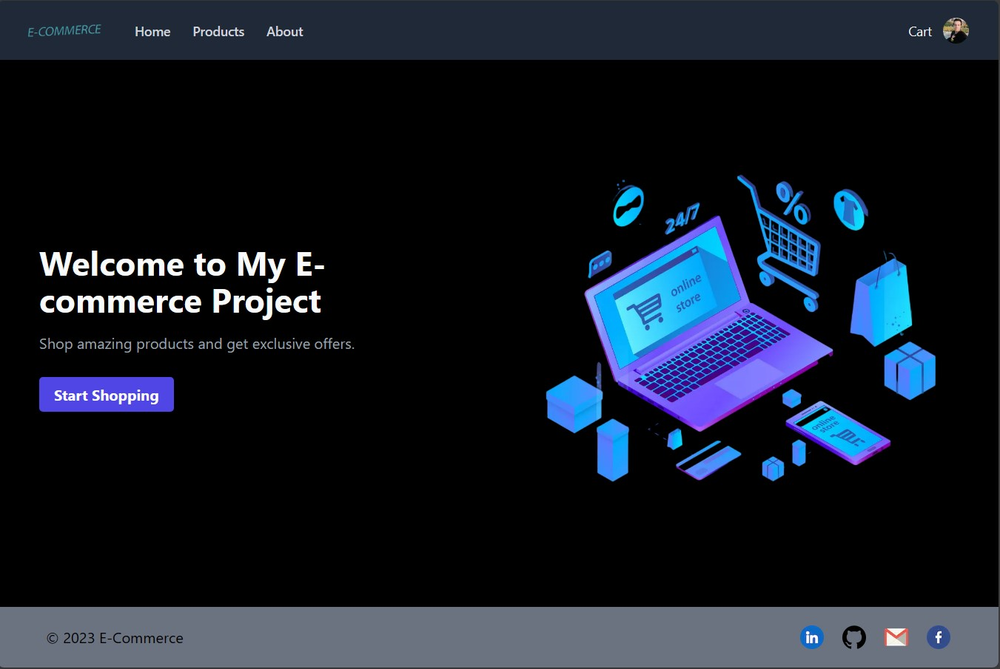

# Portfolio E-Commerce Project



## Introduction

### Team member:

Mahmoud Easa

33 years old software engineer

A student at ALX

### Person’s role:

I developed the entire project by myself, including the Front-End and Back-End. So, there is no other team member.

Demo: [https://www.mahmoudeasa.tech/](https://www.mahmoudeasa.tech/)

Presentation: [https://docs.google.com/presentation/d/11L_ol1YL3KjVfQaccy4sY7ENSf38xwUR/edit?usp=sharing&ouid=109256112409143434776&rtpof=true&sd=true](https://docs.google.com/presentation/d/11L_ol1YL3KjVfQaccy4sY7ENSf38xwUR/edit?usp=sharing&ouid=109256112409143434776&rtpof=true&sd=true)

If you want to run the code locally:

## To Run the Back End

First, you want to install the requirements file

Second, run this command in the root directory:

```bash
python3 -m api.v1.app
```

This is a [Next.js](https://nextjs.org/) project bootstrapped with [`create-next-app`](https://github.com/vercel/next.js/tree/canary/packages/create-next-app).

## Getting Started

## To Run the Front End

First, go to the front-end directory:

Second, run the development server:

```bash
# First:
npm install
# or
npm i

# Then:
npm run dev
# or
yarn dev
# or
pnpm dev
# or
bun dev
```

Open [http://localhost:3000](http://localhost:3000) with your browser to see the result.

You can start editing the page by modifying `app/page.js`. The page auto-updates as you edit the file.

This project uses [`next/font`](https://nextjs.org/docs/basic-features/font-optimization) to automatically optimize and load Inter, a custom Google Font.

## Learn More

To learn more about Next.js, take a look at the following resources:

-   [Next.js Documentation](https://nextjs.org/docs) - learn about Next.js features and API.
-   [Learn Next.js](https://nextjs.org/learn) - an interactive Next.js tutorial.

You can check out [the Next.js GitHub repository](https://github.com/vercel/next.js/) - your feedback and contributions are welcome!

## Deploy on Vercel

The easiest way to deploy your Next.js app is to use the [Vercel Platform](https://vercel.com/new?utm_medium=default-template&filter=next.js&utm_source=create-next-app&utm_campaign=create-next-app-readme) from the creators of Next.js.

Check out our [Next.js deployment documentation](https://nextjs.org/docs/deployment) for more details.
